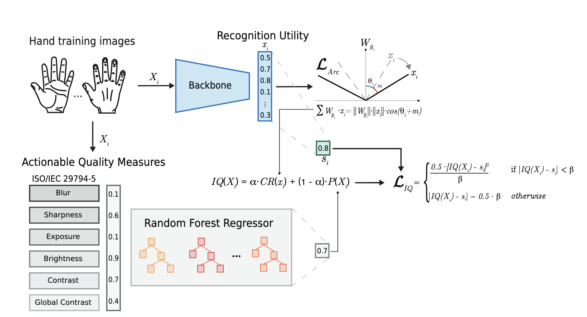

#### This is the official repository of the paper:
### PCR-HIQA: Perceptual Classifiability Ratio for Hand Image Quality Assessment 
### Paper accepted at [IJCB 2024](https://ijcb2024.ieee-biometrics.org/accepted-papers/)

 

<hr/>


## PCR-HIQA training ##
1. In the paper, we employ HaGrid as the training dataset and testing for PCR-FIQA which can be downloaded from [HaGrid website](https://github.com/hukenovs/hagrid) 
2. Unzip the dataset and organise it as follows:

```
.
├── train                               # Training set folder
│   ├── subject-ID-1                    # Subject ID
│       ├── peace                       # Gesture name
│           ├── right                   # right hand side
│               ├── images1.jpg         # images
│               ├── images1.jpg 
│           ├── left                    # left hand side
│           └── ...                     # etc.
│       ├── fist                        # Gesture name
│       └── ...                         # etc.
│   ├── subject-ID-2                    # More hand subject IDs
│       └── ...                         # etc.
├── test                                # Test set folder similar to the training folder
│   └── ...                             # etc.     

```  

3. crop the hand ROI using the script in ./utils/get_gestures.py 
4. pip install -r requirements.txt
5. All code are trained and tested using PyTorch 1.13
Details are under (Torch)[https://pytorch.org/get-started/locally/]
<hr/>

### PCR-HIQA ###
Set the following in the config.py
2. config.network = "efficientnet"
3. config.dataset = "hagrid" 
4. Run ./run_PCR.sh
<hr/>

### You can also train and evaluate CR-FIQA, as the PCR-HIQA implementation is based on the [CR-FIQA](https://github.com/fdbtrs/CR-FIQA) official repository. 

### The pretrained model for the best parameter configuration of PCR-HIQA can be found in ./weights

## Evaluation ##
To extract hand image quality scores, use the following script
```
python quality_extraction.py --data_dir <input_dir> --weights ./weights/PCR_HIQA_0.7/28690backbone.pth --output_path <output_file.json> --hand <right|left> 
```

## Citation ##
If you use any of the code provided in this repository or the models provided, please cite the following paper:
```
@inproceedings{GonzalezSoler-PCrHIQA-IJCB-2024,
    Author = {L. J. Gonzalez-Soler and M. Grimmer and D. Fischer and C. Rathgeb and C. Busch},
    Booktitle = {Proc. Intl. Joint Conf. on Biometrics ({IJCB})},
    Month = {September},
    Pages = {1--10},
    Title = {PCR-HIQA: Perceptual Classifiability Ratio for Hand Image Quality Assessment},
    Year = {2024}
}

```


## License ##

This project is licensed under the terms of the Attribution-NonCommercial 4.0 International (CC BY-NC 4.0) license. 

Copyright (c) 2024 Hochschule Darmstadt, Darmstadt, Germany